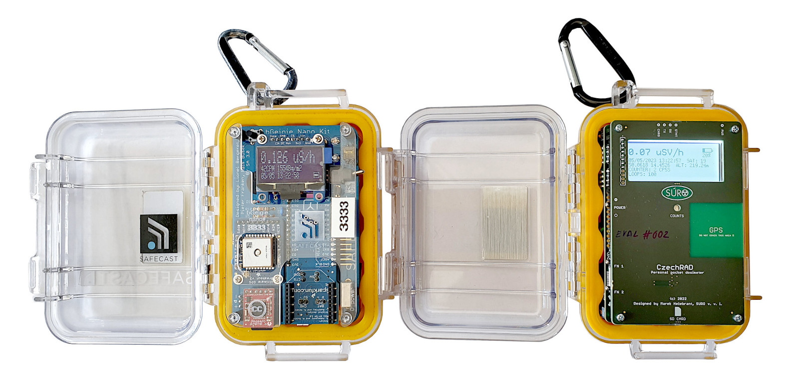
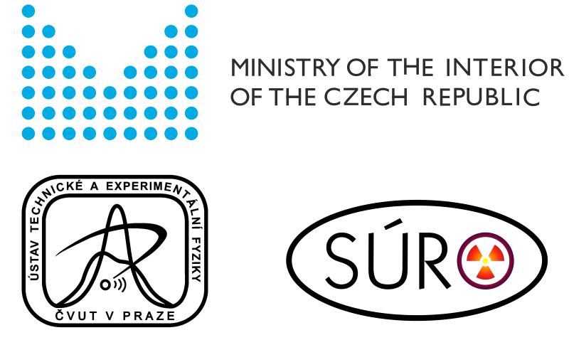

# CzechRad

[Pro českou verzi stránky klikněte zde](Readme_CZ.md)  

Mobile detector for radiation mapping - similar to SAFECAST bGeigie Nano. 

The device is being developed by [National Radiation Protection Institute (SÚRO)](https://www.suro.cz/en) in cooperation with [Institute of Experimental and Applied Physics, Czech Technical University in Prague)](http://www.utef.cvut.cz/ieap)

[Technical details here](/HARDWARE_details)  
[Gallery of high resolution photos here](https://flic.kr/s/aHsmUcpD1h)  

Obb: Safecast bGeigie Nano (vlevo) a CzechRad z předprodukční série

The device will be finished and manufactured within the project:

### Title: Centrum pro podporu obyvatelstva pro případ skutečného nebo domnělého vzniku mimořádných jaderných a radiačních událostí

### (English: Center for the support of the population in case of actual or suspected occurence of extraordinary nuclear and radiation events)

Duration: 2021 — 2025

ID: VJ01010116

Provider:	[Ministry of the Interior of the Czech Republic](https://www.mvcr.cz/mvcren/) 

Programme:	Strategická podpora rozvoje bezpečnostního výzkumu ČR 2019-2025 (IMPAKT 1) 

(English: Strategic support for the development of security research in the Czech Republic 2019-2025 (IMPAKT 1))

### Device development goals

1) create a bGeigie Nano equivalent from the measurement point of view

2) keep the advantages of the size, the same long-term proven sturdy Pelican case

3) keep the same data format and structure e.g. plain text LOG files so we can:
    
    - upload to Safecast API without need
      to change anything
    
    - use our current offline software tools 
      developed for Safecast data

BUT we wanted to change several things we do not like on the SAFECAST device ...

### Different production / assembly approach

[SAFECAST bGeigie Nano](https://safecast.org/devices/bgeigie-nano/) consists of several modules connected / soldered together - some of them are obsolete and possible to get from US provider only. Assembly requires most of the modules to be soldered together, which makes hardware diagnostics and repairs complicated.

CzechRad uses only two boards instead of several 3rd party made modules. These boards are built using standard electronic components available worldwide from big sellers like Farnell, RS Components, Mouser Electronics etc. 

This eliminates the dependency on particular 3rd party module producers - we only rely on source electronic components manufacturer = we can buy components directly, not through US. module reseller. The configuration should also make diagnostics easier.

### CzechRad - Czech made

Both two boards manufactured and assembled in the Czech Republic.
