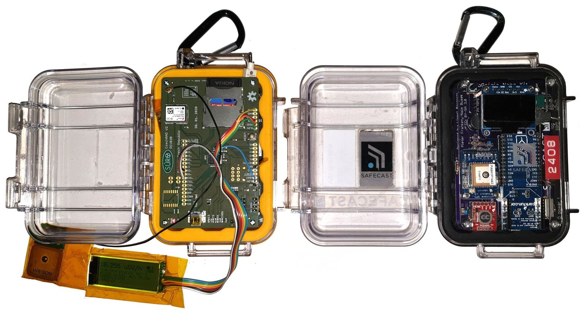

# CzechRad

[For English version click here](README.md)  

Mobilní detektor pro radiační mapování - podobný přístroji SAFECAST bGeigie Nano. [Technical details here](/HARDWARE_details)  

Přístroj bude dokončen a vyroben v rámci projektu:

### Název projektu: Centrum pro podporu obyvatelstva pro případ skutečného nebo domnělého vzniku mimořádných jaderných a radiačních událostí

### (English: Center for the support of the population in case of actual or suspected occurence of extraordinary nuclear and radiation events)

Trvání: 2021 — 2025

ID: VJ01010116

Poskytovatel 	MV0 - Ministerstvo vnitra (MV)

Program 	VJ - Strategická podpora rozvoje bezpečnostního výzkumu ČR 2019 - 2025 (IMPAKT 1)  (2019 - 2025)

[další informace o projektu - Informační systém výzkumu, vývoje a inovací (IS VaVaI)](https://www.isvavai.cz/cep?s=jednoduche-vyhledavani&ss=detail&n=0&h=VJ01010116)

### Cíle vývoje zařízení

1) vytvořit ekvivalentní zařízení k přístroji bGeigie Nano equivalent from the measurement point of view

2) zachovat výhody malé velikosti a stejné, dlouhodobě prověřené odolné pouzdro Pelican

3) zachovat stejný formát dat i jejich strukturu - tj. LOG soubory v textovém formátu, aby bylo možné:
    
    - nahrávat data do Safecast API bez nutnosti zásadních změn
    
    - využívat stávající nástroje pro offline zpracování dat, vyvinuté původně pro data z přístrojů Safecast

ALE chtěli jsme změnit několik věcí, které se nám na přístrojích SAFECAST nelíbí ...

### Jiný přístup k výrobě / montáži

Přístroj [SAFECAST bGeigie Nano](https://safecast.org/devices/bgeigie-nano/) je tvořen z mnoha navzájem propojených / sletovaných modulů - některé z nich jsou zastaralé a jejich pořízení je problematické - už se skoro neprodávají, některé lze koupit pouze od amerických dodavatelů. Sestavení přístrojer vyžaduje sletování většiny modulů což výrazně komplikuje diagnostiku, servis a případné opravy přístroje.

CzechRad využívá pouze dvě desky s elektronikou místo mnoha mnoha komerčních modulů třetích stran. Tyto desky využívají standardní elektronické součástky dostupné celosvětově prostřednictvím velkých prodejců jako např. Farnell, RS Components, Mouser Electronics atd. 

Tím se eliminuje závislost na konkrétních dodavatelích různých modulů - jsme závislí pouze na výrobcích základních elektronických součástek, které kupujeme přímo od českého / evropského zastoupení prodejce, nikoliv přes amerického distributora. 

Konfigurace využívající pouze dvě desky s elektronikou by také měla zjednodušit diagnostiku přístroje.

### CzechRad - vyrobeno v České Republice

Obě desky s elektronikou jsou vyráběny a osazovány v České Republice firmou Tesla.

*...Nemyslíme [tuhle Teslu](https://cs.wikipedia.org/wiki/Tesla_(automobilka)) založenou 2003 v USA, co vyrábí auta.*

*...ale [tuhle Teslu](https://cs.wikipedia.org/wiki/Tesla_(podnik)) - tradičního výrobce elektrotechniky, založenou v Československu v roce 1946.*

