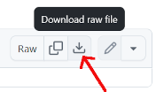

# CzechRad scripts

Here I provide scripts for working with CzechRad data. I am not a programmer, but I can do fine tuning / debugging of the scripts if AI writes them for me first. If it helps you, feel free to use the scripts published here. I cannot provide technical support for these scripts or modify them at your request. If you make any useful modifications to the script, or write a new script, please consider sharing it with other CzechRad users here. Thank you

## Supported Platform

After several negative experiences on Windows, we are creating these scripts only for GNU/Linux. It is beyond our time to determine whether the problem was in Windows or in the limitations of the corporate Windows environment... It works in Linux, the scripts can be easily deployed on a server, and anyone can set up a Linux environment on their computer for free, for example using [ORACLE Virtualbox](https://www.virtualbox.org/wiki/Downloads) - including institutions/companies. For a lightweight installation, we recommend [current LTS version of Lubuntu Linux](https://lubuntu.me/downloads/).

Tested on current LTS (K)Ubuntu but should work on Debian Linux without any problems. Scripts use standard tools like "grep", "sed" etc.

**Use:**
Download package in ZIP file (click the link and then the Download raw file icon):



Unpack to your computer. In GNU/Linux environment copy the CzechRad or Safecast *.LOG data you wan to process to "input" folder. In GNU/Linux environment run terminal window from the script folder (can be usually done from default file manager) and then just drag and drop the *.sh file in your terminal window and press Enter.

## Script 01 - find and copy all *.LOG files measured in particular year from "input" to "output" folder

This script scans "input" directory for *.LOG files and copies those containing "2024" inside to "output" folder. Feel free to replace "2024" with other year according to your needs. Under Windows, I recommend using more advanced text editors like [PSPad](https://www.pspad.com/en/), [Notepad++](https://notepad-plus-plus.org/) for script editing and not using default Notepad in Windows - just to be safe. 

**Download:** [CzechRad_script_001_find_2024_data.zip (2.63 KB)](https://github.com/juhele/CzechRad/blob/main/SCRIPTS/CzechRad_script_001_find_2024_data.zip)

## Script 02 - sort the *.LOG files from "input" into subfolders (in "output") according to the year and month of measurement

This script scans "input" directory for *.LOG files and sorts them into subfolders (in "output") according to the year and month of measurement. Under Windows, I recommend using more advanced text editors like [PSPad](https://www.pspad.com/en/), [Notepad++](https://notepad-plus-plus.org/) for script editing and not using default Notepad in Windows - just to be safe. 

**Download:** [CzechRad_script_002_sort_into_folders.zip (2.97 KB)](https://github.com/juhele/CzechRad/blob/main/SCRIPTS/CzechRad_script_002_sort_into_folders.zip)

## Script 03 - calculate statistics for *.LOG files in a folder

This script scans "input" directory for *.LOG files and calculates a summary statistics file in a comma separated CSV file you can easily load in spreadsheet software like Microsoft Excel or LibreOffice Calc. The result looks like:

```
file,device_type,device_ID,date,start_time_UTC,points,duration,ADER_max
04860412_l.LOG,CZRDD,0486,2025-04-12,09:30:10,2461,03:25:05,0.5479
04860411_l.LOG,CZRDD,0486,2025-04-11,14:03:26,333,00:27:45,0.4018
04860413_l.LOG,CZRDD,0486,2025-04-13,07:33:32,784,01:05:20,0.3653
```
ADER_max is calculated from the number of pulses from five-second measurements. The ADER values ​​calculated in this way fluctuate greatly and therefore the maximum values ​​may be higher.

Under Windows, I recommend using more advanced text editors like [PSPad](https://www.pspad.com/en/), [Notepad++](https://notepad-plus-plus.org/) for script editing and not using default Notepad in Windows - just to be safe. 

**Download:** [CzechRad_script_003_log_statistics.zip (3.18 KB)](https://github.com/juhele/CzechRad/blob/main/SCRIPTS/CzechRad_script_003_log_statistics_v2.zip)

## License:

Created with Grok AI, released under MIT No Attribution License
Copyright 2024 Jan Helebrant, czechrad@suro.cz, www.suro.cz

Permission is hereby granted, free of charge, to any person obtaining a copy of this software and associated documentation files (the “Software”), to deal in the Software without restriction, including without limitation the rights to use, copy, modify, merge, publish, distribute, sublicense, and/or sell copies of the Software, and to permit persons to whom the Software is furnished to do so.

THE SOFTWARE IS PROVIDED “AS IS”, WITHOUT WARRANTY OF ANY KIND, EXPRESS OR IMPLIED, INCLUDING BUT NOT LIMITED TO THE WARRANTIES OF MERCHANTABILITY, FITNESS FOR A PARTICULAR PURPOSE AND NONINFRINGEMENT. IN NO EVENT SHALL THE AUTHORS OR COPYRIGHT HOLDERS BE LIABLE FOR ANY CLAIM, DAMAGES OR OTHER LIABILITY, WHETHER IN AN ACTION OF CONTRACT, TORT OR OTHERWISE, ARISING FROM, OUT OF OR IN CONNECTION WITH THE SOFTWARE OR THE USE OR OTHER DEALINGS IN THE SOFTWARE.
